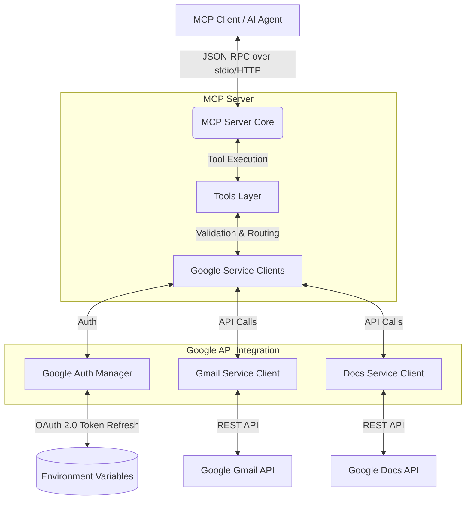

# Architecture: Generic MCP Server for Gmail and Google Docs

## 1. System Overview

The MCP (Model Context Protocol) server acts as an integration layer between any MCP-compatible AI agent (e.g., Claude, Cursor) and Google Workspace APIs (Gmail, Google Docs). It abstracts away the complexities of Google's OAuth 2.0 authentication and API interactions, exposing standard, generic tools that any reasoning engine can utilize.

## 2. High-Level Architecture



## 3. Technology Stack

*   **Language/Runtime:** TypeScript / Node.js (Aligns with the standard MCP SDK and the proposed `package.json` structure).
*   **Protocol:** Official `@modelcontextprotocol/sdk`.
*   **Google Integration:** Official `googleapis` npm package.
*   **Configuration Management:** `dotenv` for secure environment variable handling.
*   **Testing:** `jest` (or similar) with mock capabilities for Google APIs.

## 4. Component Design

The system is designed with a clean, modular architecture to ensure separation of concerns and maintainability.

*   **`src/server/mcp-server.ts`**: The core entry point. Handles MCP server initialization, tool registration, and incoming JSON-RPC request routing.
*   **`src/google/auth.ts`**: Manages the OAuth 2.0 lifecycle. Initializes the Google Auth client using environment variables and handles automatic token refreshing.
*   **`src/google/gmail-client.ts`**: A wrapper around the `googleapis` Gmail library. Abstracts the complexity of MIME message construction and API payload formatting.
*   **`src/google/docs-client.ts`**: A wrapper around the `googleapis` Docs library. Handles document structure retrieval and constructs the `batchUpdate` requests necessary for appending text.
*   **`src/tools/`**: Contains the business logic for each exposed MCP tool. Each tool module is responsible for input validation and coordinating with the Google Service Clients.
*   **`src/utils/validation.ts`**: Shared utilities for parameter validation (e.g., email regex checking).

## 5. Authentication Flow

Authentication leverages Google OAuth 2.0 and is designed to run securely in a background/server environment without requiring constant user interaction.

1.  **Configuration:** The server loads `GOOGLE_CLIENT_ID`, `GOOGLE_CLIENT_SECRET`, and a long-lived `GOOGLE_REFRESH_TOKEN` from environment variables.
2.  **Initialization:** The `Auth Manager` configures an `OAuth2Client` using these credentials.
3.  **Token Refresh:** The `googleapis` client automatically handles exchanging the refresh token for a short-lived access token when making API requests.
4.  **Security Constraint:** Access tokens are strictly kept in server memory. They are never logged or returned to the AI agent.

## 6. MCP Tool Definitions & Workflows

### 6.1. `gmail_create_draft`
*   **Purpose:** Creates a draft email in the user's Gmail account.
*   **Validation:** Ensures at least one `to` recipient, valid email formats, and presence of `subject` and `body`.
*   **Execution:** 
    1. Validates input.
    2. Constructs a base64url encoded MIME message.
    3. Calls `gmail.users.drafts.create`.
    4. Returns a structured response containing the `draft_id`.

### 6.2. `gmail_send_email`
*   **Purpose:** Immediately sends an email.
*   **Safety:** The tool schema explicitly warns the AI agent that this is a destructive action with immediate external side effects.
*   **Execution:**
    1. Validates input (same as draft).
    2. Constructs a base64url encoded MIME message.
    3. Calls `gmail.users.messages.send`.
    4. Returns a structured response containing the `message_id` and `thread_id`.

### 6.3. `google_doc_append`
*   **Purpose:** Appends text to an existing Google Document.
*   **Validation:** Ensures `document_id` and `content` are present.
*   **Execution:**
    1. Validates input.
    2. (Optional based on API needs) Fetches document structure to determine the `endOfSegmentLocation`.
    3. Constructs a `batchUpdate` request with an `insertText` operation at the determined index.
    4. Calls `docs.documents.batchUpdate`.
    5. Returns a structured success response.

## 7. Error Handling Strategy

The server normalizes all errors into predictable, structured JSON responses, allowing the AI agent to make informed decisions on how to proceed.

*   **Standardized Format:**
    ```json
    {
      "success": false,
      "error": {
        "code": "ERROR_CODE",
        "message": "Human and machine-readable explanation."
      }
    }
    ```
*   **Error Categories:**
    *   `VALIDATION_ERROR`: Thrown prior to API calls if input parameters are missing or malformed.
    *   `AUTHENTICATION_ERROR`: Thrown if the server fails to refresh Google tokens or credentials are invalid.
    *   `AUTHORIZATION_ERROR`: Thrown if the authenticated user lacks access to the specific resource (e.g., a private Google Doc).
    *   `GOOGLE_API_ERROR`: Maps to upstream errors from Google (e.g., rate limiting, 500s).
    *   `INTERNAL_ERROR`: Unhandled exceptions within the MCP server itself.

## 8. Security Requirements

*   **Least Privilege:** The Google Cloud OAuth consent screen is configured strictly with narrow scopes (`https://www.googleapis.com/auth/gmail.compose`, `https://www.googleapis.com/auth/gmail.send`, `https://www.googleapis.com/auth/documents`).
*   **Secret Management:** Secrets are injected via the runtime environment. A `.env.example` is provided, but actual secrets are excluded from version control (`.gitignore`).
*   **Data Privacy:** 
    *   The server does not persist any user data, email contents, or document text.
    *   Logging is sanitized to exclude Personally Identifiable Information (PII) and sensitive OAuth tokens.

## 9. Future Extensibility

The architecture ensures the server can scale to support additional Google Workspace capabilities.

*   **Adding Tools:** Adding a tool like `google_calendar_create_event` only requires adding a new client in `src/google/calendar-client.ts` and a new tool handler in `src/tools/calendar/create-event.ts`. The core MCP server simply registers the new tool schema.
*   **Statelessness:** The server remains stateless, meaning it can be easily deployed via containerization (Docker) or run locally by individual developers without complex database dependencies.
